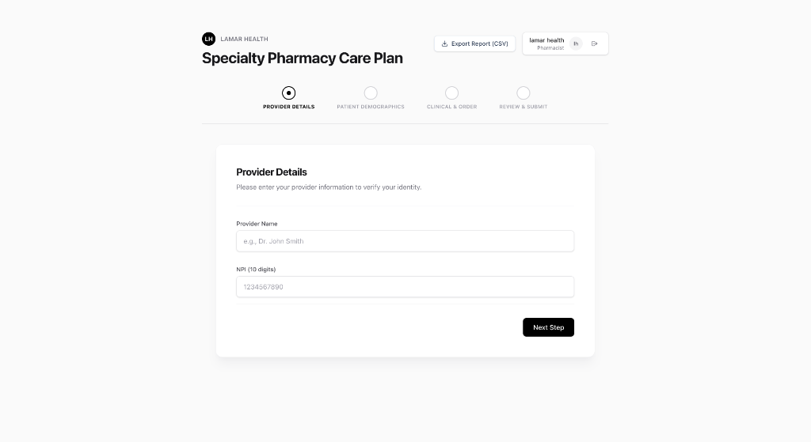
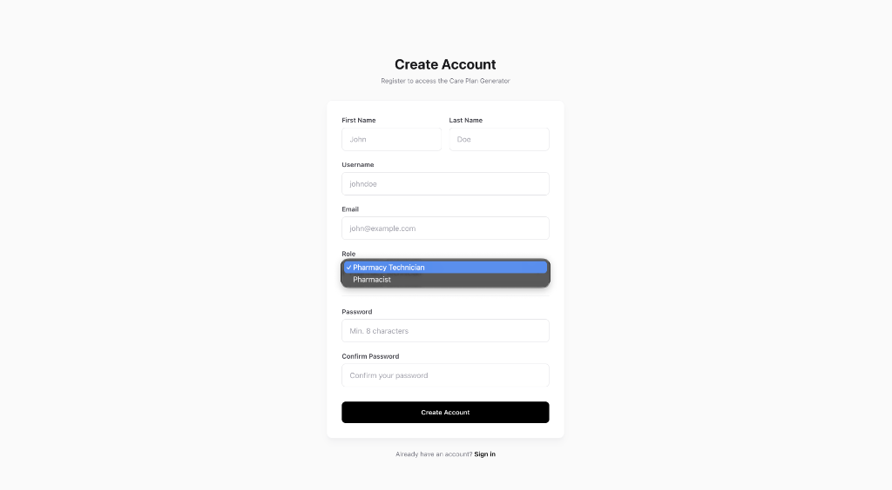
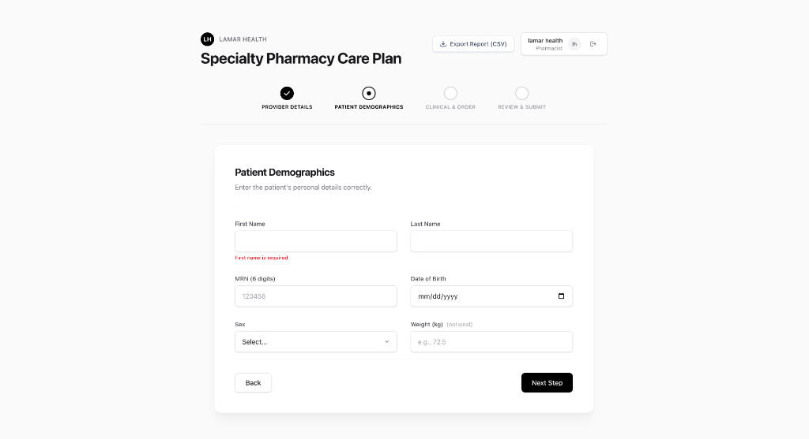
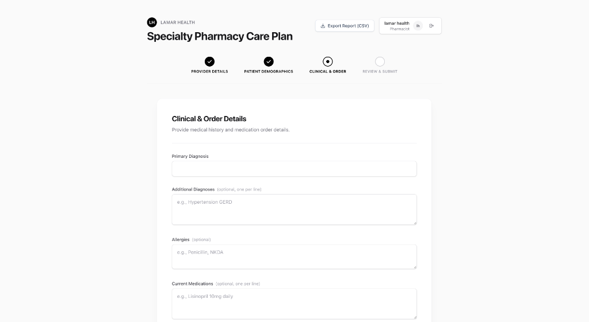

# Specialty Pharmacy Care Plan Generator (Premium UI)

AI-assisted intake and care-plan generator for specialty pharmacy teams.  
**Now features JWT Authentication with Role-Based Access Control and a Premium Black & White aesthetic.**

## UI Walkthrough
The application features a guided 4-step wizard with a minimalist, high-contrast design.

| | |
| :---: | :---: |
|  |  |
|  |  |
|  | |

Frontend is a guided wizard (Next.js 16 + Tailwind v4). Backend is Django REST with JWT authentication, role-based access, strong validation, persistence, and LLM integration.

## Overview
- **Authentication:** JWT-based auth with role-based access control (Pharmacist, Technician, Admin).
- **Validation:** Zod on the client; DRF serializers on the server. Provider name↔NPI and patient name/DOB/sex↔MRN consistency checks prevent mismatched credentials.
- **Persistence & Logic:** Models + services handle deduplication (patients, providers), duplicate order warnings, and CSV export.
- **Transport:** REST endpoints for auth, submit, care-plan generation, export, and credential validation.
- **AI:** Gemini-backed care plan generation with feedback loop for continuous improvement.
- **Tests:** Unit + integration tests cover serializers, services, and API flows. Easy to extend.

## Quickstart (runs end-to-end)

### Prerequisites
- Docker/Docker Compose
- Node.js 18+
- Python 3.9+

### 1. Database
```bash
docker-compose up -d  # Postgres on port 5433
```

### 2. Backend
```bash
cd backend
python3 -m venv venv
source venv/bin/activate
pip install -r requirements.txt
python manage.py migrate
python manage.py runserver 0.0.0.0:8000
```

Required env (`backend/.env`):
```
GEMINI_API_KEY=your-gemini-key   # if omitted, backend returns a mock care plan
```

### 3. Frontend
```bash
npm install
npm run dev
```

Open `http://localhost:3000` - you'll be redirected to login.

### 4. Create a User Account
Register at `http://localhost:3000/register` or via API:
```bash
curl -X POST http://localhost:8000/api/auth/register/ \
  -H "Content-Type: application/json" \
  -d '{
    "username": "johndoe",
    "email": "john@example.com",
    "password": "SecurePass123!",
    "password_confirm": "SecurePass123!",
    "first_name": "John",
    "last_name": "Doe",
    "role": "pharmacist",
    "provider_npi": "1234567890"
  }'
```

## Authentication

### User Roles
| Role | Permissions |
|------|-------------|
| **Pharmacist** | Full access: create orders, generate/edit care plans, submit feedback |
| **Technician** | Create orders, generate care plans (read-only), submit feedback |
| **Admin** | All pharmacist permissions + user management |

### Auth Endpoints
| Endpoint | Method | Description |
|----------|--------|-------------|
| `/api/auth/register/` | POST | Create new user account |
| `/api/auth/login/` | POST | Login, returns JWT tokens + user info |
| `/api/auth/refresh/` | POST | Refresh access token |
| `/api/auth/logout/` | POST | Blacklist refresh token |
| `/api/auth/verify/` | GET | Verify token, returns user info |
| `/api/auth/profile/` | GET/PUT | View/update user profile |
| `/api/auth/change-password/` | POST | Change password |

### Security Features
- **30-minute access tokens** for PHI protection
- **1-day refresh tokens** with rotation
- **Token blacklisting** on logout/rotation
- **Password validation** (min 8 chars, common password check)
- **Automatic token refresh** on frontend

## API Surface (transport)

### Core Endpoints
- `POST /api/provider/validate/` — validates provider name/NPI pairing
- `POST /api/patient/validate/` — validates patient name/DOB/sex vs MRN pairing
- `POST /api/submit/` — persists provider/patient/order, warns on 24h duplicate meds
- `POST /api/generate-care-plan/` — generates and stores a care plan for an order
- `POST /api/care-plan/update/` — save edits to an existing care plan
- `POST /api/feedback/submit/` — submit feedback on care plans (triggers LLM extraction)
- `GET /api/export/` — downloads CSV of orders + patient/provider context

## Tests (critical logic covered)

### Backend
```bash
cd backend
source venv/bin/activate
python manage.py test careplan
```

### Frontend
```bash
npm run test
```

Key coverage: serializers (NPI/MRN/date/required), services (dedupe, duplicate orders), views (submit flow, conflict handling), auth (JWT, registration, login).

## Project Structure (modular responsibilities)

### Backend (`backend/`)
```
careplan/
├── models.py           # Provider, Patient, Order, CarePlan, CarePlanFeedback
├── models_auth.py      # Custom User model with roles (Pharmacist/Technician/Admin)
├── serializers.py      # Core validation serializers
├── serializers_auth.py # Auth serializers (JWT, registration, profile)
├── views.py            # Core REST endpoints
├── views_auth.py       # Auth endpoints (login, register, logout, profile)
├── services.py         # Business logic (dedupe, feedback batch processing)
├── llm.py              # Gemini integration + feedback extraction
├── urls.py             # Core URL routing
├── urls_auth.py        # Auth URL routing
└── test_*.py           # Unit/integration tests
```

### Frontend (`src/`)
```
├── app/
│   ├── layout.tsx      # Root layout with AuthProvider
│   ├── providers.tsx   # Client-side providers
│   ├── page.tsx        # Protected main page with user info
│   ├── login/page.tsx  # Login page
│   └── register/page.tsx # Registration page
├── components/
│   ├── PatientForm.tsx # 4-step wizard with care plan editing
│   └── ExportButton.tsx
└── lib/
    ├── validation.ts   # Zod schemas
    ├── auth.ts         # Auth API helpers, token management
    └── AuthContext.tsx # React auth context
```

## Operational Notes
- **Authentication required:** All core functionality requires login
- **Role-based access:** Only pharmacists can edit care plans
- **Duplicate patients** are blocked; duplicate orders within 24h raise warnings but are allowed
- **DOB validation:** Future birth dates are rejected on both frontend and backend
- **Errors are sanitized** (no PHI/keys) and rendered in red, monospace on the client
- **Running without `GEMINI_API_KEY`** returns a mock care plan so the app remains demoable
- **Token expiry:** Access tokens last 30 minutes; frontend auto-refreshes transparently
